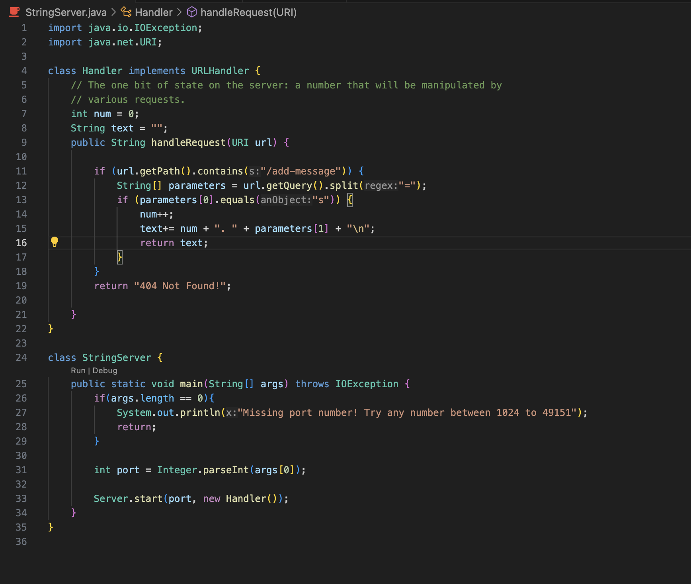
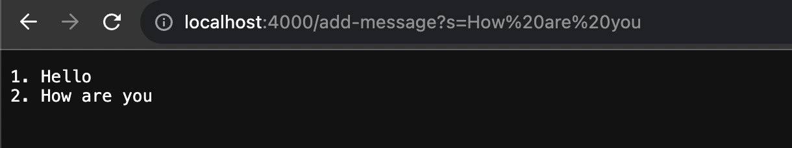
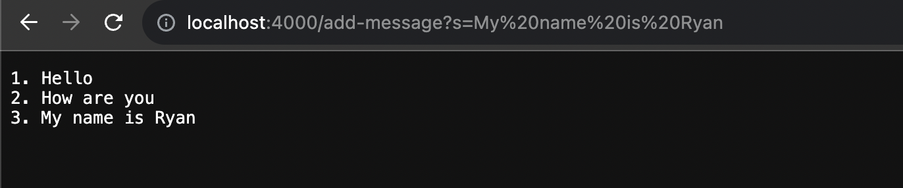
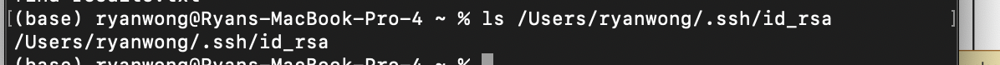
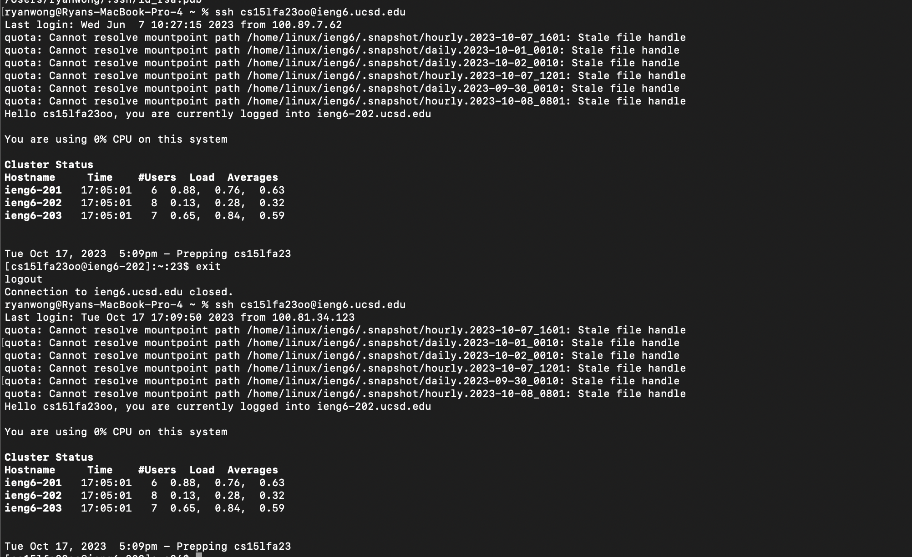

# Lab Report 2 - Ryan Wong
## String Server
1. 
    > This is the code for my String Server class.
2. 
    > Here, the handleRequest method is being called, whcih expects a url argument. The url being passed is "/add-message?s=How are you". It needs the url as the method needs to know the path that is being requested, so it can then parse it and perform any actions depending on the path. In this case, resulting in both the int num and string text values being altered. The num value is being incremented to 2 while the text value is adding "How are you" as well as new line to it.
3. 2. 
    > Here, the handleRequest method is being called, whcih expects a url argument. The url being passed is "/add-message?s=My name is Ryan". It needs the url as the method needs to know the path that is being requested, so it can then parse it and perform any actions depending on the path. In this case, resulting in both the int num and string text values being altered. The num value is being incremented to 3 while the text value is adding "My name is RYan" as well as new line to it.

## SSH
1. 
    > This is the path to my private key for SSH to login to ieng6 on my personal computer.
2. 
    > This is the path to my public key for SSH to login to ieng6 on my ieng6 account.
3. 
    > This is me logging into my ieng6 account without having to enter my password due to me setting up the private and public keys using scp.

## Conclusion
This lab today showed me what the scp command does as well as how I could leverage it to login using ssh. Before I did not know there was a way to login using ssh without entering a password. The lab today showed me exactly how I could use the scp command so I wouldn't have to enter my password everytime I wanted to ssh into my ieng6 account!